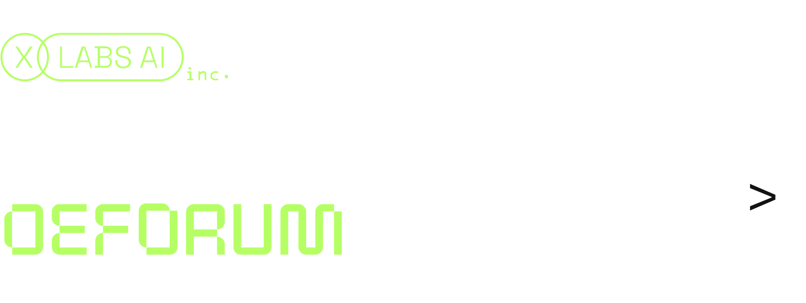

# DeforumKlein — Deforum animations with FLUX.2-klein-4B

Deforum animation pipeline using [FLUX.2-klein-4B](https://huggingface.co/black-forest-labs/FLUX.2-klein-4B) via HuggingFace diffusers. Based on the original [Deforum](https://github.com/deforum-art/deforum-stable-diffusion) project.

### Clone repository
```bash
git clone https://github.com/CanFromEarth/DeforumKlein.git
cd DeforumKlein
```

### Create virtual environment
```
python3 -m venv deforum_xflux_env
source deforum_xflux_env/bin/activate
```

### Install requirements
```bash
python3 -m pip install -r requirements.txt
```

## Run from CLI
```bash
python run.py
```

## Acknowledgements
- [Deforum](https://github.com/deforum-art/deforum-stable-diffusion) for the animation framework
- [XLabs-AI](https://github.com/XLabs-AI/deforum-x-flux) for the original FLUX Deforum integration
- [Black Forest Labs](https://blackforestlabs.ai/) for FLUX.2-klein-4B
